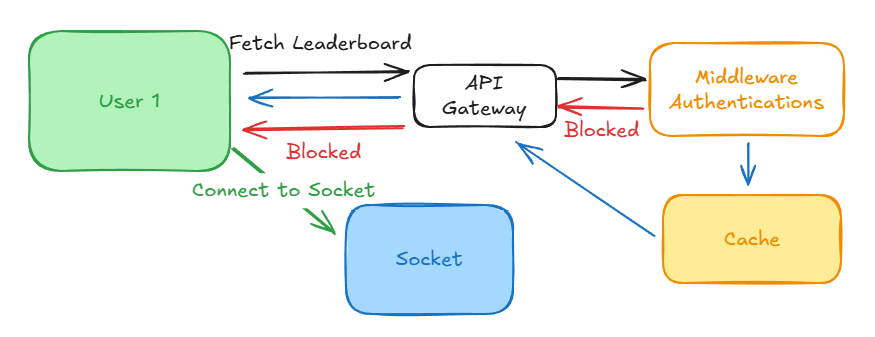
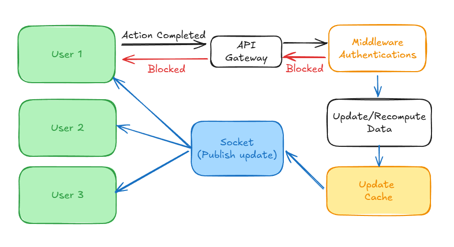

<!-- # Task

Write the specification for a software module on the API service (backend application server).

1. Create a documentation for this module on a `README.md` file.
2. Create a diagram to illustrate the flow of execution.
3. Add additional comments for improvement you may have in the documentation.
4. Your specification will be given to a backend engineering team to implement.

### Software Requirements

1. We have a website with a score board, which shows the top 10 user’s scores.
2. We want live update of the score board.
3. User can do an action (which we do not need to care what the action is), completing this action will increase the user’s score.
4. Upon completion the action will dispatch an API call to the application server to update the score.
5. We want to prevent malicious users from increasing scores without authorisation. -->

# Top User's Score

## Goals/Requirements:

### 1. We have a website with a score board, which shows the top 10 user’s scores.

### 2. We want live update of the score board.

### 3. User can do an action (which we do not need to care what the action is), completing this action will increase the user’s score.

### 4. Upon completion the action will dispatch an API call to the application server to update the score.

### 5. We want to prevent malicious users from increasing scores without authorisation.

## Architecture:

### 1. User's Score API

#### - Complete CRUD Functionality

### 2. User Authentication

#### - Preferred framework (JWT etc)

### 3. Data Storage

#### - Database

#### - Caching layer

### 4. Security Layers

#### - Middlewares (CORS, tokens)

#### - Server validations (Contracts)

#### - Rate limiters

#### - Server mutation logs

### 5. Real Time Setup (Sockets or other tool)

#### - Tool that will satisfy realtime and performance

## Flow Chart

### Initial load



**On First Load**

- User will send request to our API with necessary headers and payloads.
- User will undergo our security measures and authentication.
- After completing the middleware process, will grab data from cache to return to the user.
- User will connect to socket on its clients end for realtime experience.

### Realtime Setup



**On First Load**

- User who have done action will send request to our API with necessary headers and payloads to update its own data.
- User will undergo our security measures and authentication.
- After completing the middleware process, will update necessary data for the user.
- After successfully updating our database, will update cache
- Then will publish the new update using socket to notify our connected users to update their dashboard

## Database Schema

**Users Table**

- user_id uuid PK

- score int Indexed

**Actions Table**

- action_id uuid PK

- user_id uuid FK

- timestamp bigint

## API Minimal Requirement Docs:

### **POST `/api/v1/score/update`**

To trigger when user completes an action to update their score.

**Headers**

```json
{
  "Authorization": "Bearer <jwt>",
  "Content-Type": "application/json"
}
```

**Payload**

```json
{
  "actionId": "<uuid>",
  "timestamp": 1732312312
}
```

**Response**

Success:

```json
{
  "status": "success",
  "userId": "<uuid>",
  "newScore": "<score>"
}
```

Error:

```json
{
  "status": "error",
  "error": "<error>"
}
```

### **GET `/api/v1/leaderboard`**

To get list of scoreboard.

Filters:
page - page number (default: 1)
limit - limit of result (default: 10 >> basis of pagination)
sort - (default: DESC >> to always return top results)

**Headers**

```json
{
  "Authorization": "Bearer <jwt>",
  "Content-Type": "application/json"
}
```

**Query(Optional)**

```json
{
  "page": 1,
  "limit": 10,
  "sort": "DESC"
}
```

**Response**

Success:

```json
{
  "leaderboard": [
    {
      "userId": "uuid",
      "username": "Player1",
      "score": 2900
    },
    {
      "userId": "uuid",
      "username": "Player2",
      "score": 2400
    },
    {
      "userId": "uuid",
      "username": "Player3",
      "score": 2200
    },
    {
      "userId": "uuid",
      "username": "Player4",
      "score": 2000
    },
    {
      "userId": "uuid",
      "username": "Player5",
      "score": 1990
    },
    {
      "userId": "uuid",
      "username": "Player6",
      "score": 1500
    },
    {
      "userId": "uuid",
      "username": "Player7",
      "score": 700
    },
    {
      "userId": "uuid",
      "username": "Player8",
      "score": 322
    },
    {
      "userId": "uuid",
      "username": "Player9",
      "score": 100
    },
    {
      "userId": "uuid",
      "username": "Player10",
      "score": 50
    }
  ],
  "page": 1,
  "limit": 10,
  "sort": "DESC"
}
```

Error:

```json
{
  "status": "error",
  "error": "<error>"
}
```
